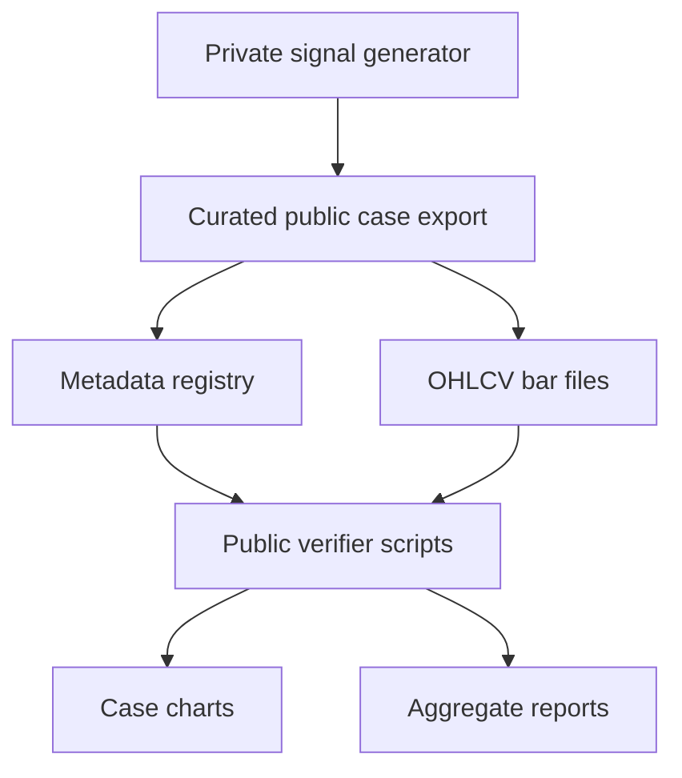

# Architecture

## Goal

This repository exposes the research infrastructure around a private trading system without publishing the alpha core.

## Layers

## Public Components

- `examples/metadata.csv`
  - one row per public case
- `examples/cases/*.csv`
  - exported OHLCV bars for charting
- `verifier/plot_public_cases.py`
  - visual verification
- `verifier/evaluate_public_cases.py`
  - reporting and summary generation

## Private Components

The private system generates the original signals and selects what can be safely exported into the public case set.

That boundary is intentional. The verifier should never generate new signals on its own.
